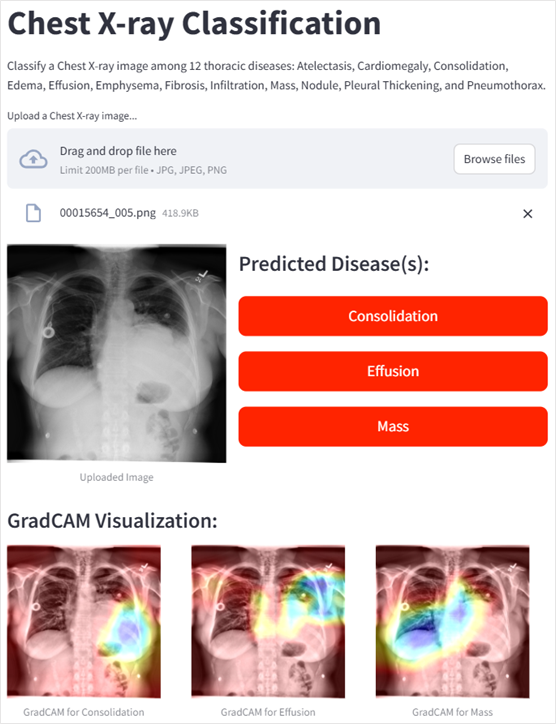
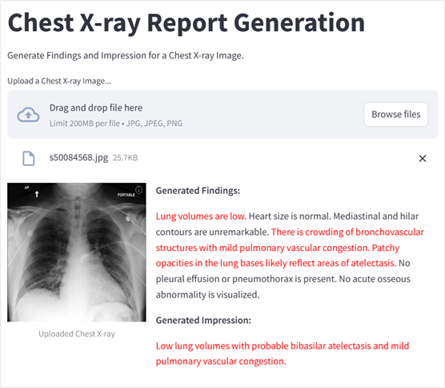

# 🩺 Radiology Report Generation from Chest X-ray Image

An AI-powered system for **automatic classification** of thoracic diseases and **radiology report generation** from chest X-ray images, built using **deep learning** models like `DenseNet121`, `Vision Transformers (ViT)`, and `BART`. This end-to-end solution includes a **Streamlit web interface** for uploading images, viewing predictions, editing reports, and downloading finalized PDF outputs.

---

## 🚀 Project Overview

This project aims to assist radiologists and clinicians by automating the diagnosis and reporting workflow of chest X-rays using **AI-based multimodal learning**. It supports:

- 🧠 **Disease classification** for 14 thoracic conditions (e.g., Cardiomegaly, Pneumothorax, Emphysema)
- 📄 **Findings and Impression generation** using Transformer-based NLP models
- 🌐 A **user-friendly web portal** for real-time interaction and report editing
- 📊 Visualization of model predictions using **Grad-CAM**

---

## 📂 Project Structure

- `model/` – Code for training classification and report generation models
- `notebooks/` – Jupyter Notebooks for model experimentation and evaluation
- `webapp/` – Streamlit-based frontend for the system
- `utils/` – Image preprocessing, text generation, and PDF creation
- `data/` – Dataset loading and formatting scripts (NIH & MIMIC-CXR)

---

## 🧠 Key Features

- **Multi-label Classification** using `DenseNet121` with AUC ~ **0.85**
- **Vision-to-Text Generation** using `ViT-GPT2` and `BART`
  - BLEU-4: `0.0648`, ROUGE-L: `0.225`, CIDEr: `3.21`
- **GradCAM heatmaps** for explainability
- **End-to-end Web Interface** with report editing and PDF download
- **Support for Patient Metadata**: Name, Age, Gender, Address

---

## 🛠️ Tech Stack

- **Languages**: Python
- **Deep Learning**: TensorFlow, PyTorch
- **NLP Models**: HuggingFace Transformers (ViT, GPT2, BART)
- **Frontend**: Streamlit
- **Visualization**: OpenCV, GradCAM
- **PDF Generation**: FPDF
- **Datasets**: NIH ChestX-ray14, MIMIC-CXR

---

## 📽️ Demo & Resources

- 📘 **[Project Report (PDF)](https://your-link.com/project-report.pdf)**
- 📊 **[Presentation Slides](https://your-link.com/presentation-slides.pdf)**
- ▶️ **[Demo Video](https://youtu.be/your-demo-video-link)**

---

## 📸 Sample Screenshots

| Classification Page | Report Generation Page |
|---------------------|------------------------|
|  |  |

---

## 🧪 Results Summary

| Model                  | Metric       | Score   |
|------------------------|--------------|---------|
| **DenseNet121**        | AUC (avg)    | 0.85    |
| **ViT-GPT2** (Findings)| BLEU-4       | 0.0347  |
|                        | ROUGE-L      | 0.4291  |
|                        | CIDEr        | 3.21    |
| **BART** (Impression)  | BLEU-4       | 0.0648  |
|                        | ROUGE-L      | 0.7151  |
|                        | CIDEr        | 4.94    |

---

## 📌 Future Improvements

- Incorporate **multimodal learning** with clinical metadata
- Improve generalization with cross-hospital datasets
- Integrate system with **EHR platforms**
- Apply **LLMs (e.g., GPT-4, Gemini)** for enhanced medical reasoning

---

## 🤝 Contributors

---

## 📜 License

This project is licensed for academic and non-commercial use. For other uses, please contact the authors or Thapathali Campus.

---

